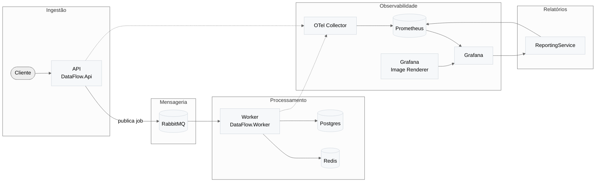

# DataFlow

> Plataforma de ingestão e processamento assíncrono de arquivos grandes com observabilidade completa e geração de relatórios.

[](https://dotnet.microsoft.com/)
[](https://docs.docker.com/compose/)
[](https://www.postgresql.org/)
[](https://www.rabbitmq.com/)

##  Sobre o Projeto

DataFlow é uma solução completa para ingestão, processamento e análise de grandes volumes de dados. Projetada para lidar com arquivos de centenas de MB até alguns GB, a plataforma utiliza processamento assíncrono, observabilidade nativa e geração automática de relatórios.

###  Principais Características

-  **Ingestão Assíncrona**: Upload de arquivos grandes via HTTP com processamento em background
-  **Observabilidade Completa**: OpenTelemetry, Prometheus e Grafana integrados
-  **Processamento em Fila**: RabbitMQ para desacoplamento e escalabilidade
-  **Relatórios Automáticos**: Geração de relatórios consolidados com métricas e dashboards
-  **Containerizado**: Stack completa via Docker Compose
-  **HTTPS**: Proxy reverso Nginx com certificados SSL
-  **Swagger/OpenAPI**: Documentação automática dos endpoints

##  Arquitetura



##  Stack Tecnológica

| Componente | Tecnologia | Versão |
|------------|-----------|--------|
| **Linguagem** | C# | .NET 9 |
| **API Framework** | ASP.NET Core Minimal API | 9.0 |
| **Banco de Dados** | PostgreSQL | 15+ |
| **Cache/Coordenação** | Redis | 7+ |
| **Mensageria** | RabbitMQ | 3.12+ |
| **Observabilidade** | OpenTelemetry, Prometheus, Grafana | Latest |
| **Containerização** | Docker Compose | v2+ |
| **Proxy Reverso** | Nginx | 1.27 |

##  Componentes

### Aplicações (`src/apps/`)

- **`DataFlow.Api`**: API REST para ingestão de arquivos, validação e gestão de jobs
- **`DataFlow.Worker`**: Worker service para processamento assíncrono de arquivos
- **`DataFlow.ReportingService`**: Serviço de geração de relatórios consolidados

### Bibliotecas (`src/libs/`)

- **`DataFlow.Core.Domain`**: Entidades, agregados e contratos de domínio
- **`DataFlow.Core.Application`**: Casos de uso, handlers (MediatR) e DTOs
- **`DataFlow.Infrastructure`**: Implementações (EF Core, Redis, RabbitMQ, parsers)
- **`DataFlow.Observability`**: Métricas customizadas e instrumentação
- **`DataFlow.Shared`**: Contratos e mensagens compartilhadas

##  Início Rápido

### Pré-requisitos

- **Docker Desktop** com Docker Compose v2
- **PowerShell** (Windows) ou **Bash** (Linux/Mac)
- **.NET 9 SDK** (opcional, para desenvolvimento local)

### 1. Clone o Repositório

```bash
git clone <repository-url>
cd data-flow
```

### 2. Gere Certificados SSL

```bash
# Windows
scripts\certs\generate-dev-certs.cmd

# Linux/Mac (com OpenSSL)
# Execute os comandos OpenSSL conforme instruções em docs/operations/tutoriais/adicionar-openssl-path.md
```

### 3. Configure Hostnames (Windows)

Adicione ao arquivo `C:\Windows\System32\drivers\etc\hosts`:

```
127.0.0.1 api.local
127.0.0.1 reporting.local
```

### 4. Suba a Stack

```bash
# Criar rede Docker (se necessário)
docker network create dev_net

# Subir todos os serviços
docker compose --profile proxy --profile api --profile worker --profile reporting up -d
```

### 5. Acesse os Serviços

- **Swagger API**: https://api.local:8443/swagger
- **Swagger Reporting**: https://reporting.local:8444/swagger
- **Grafana**: http://localhost:3000
- **Prometheus**: http://localhost:9090

>  **Nota**: Certificados são autoassinados. Aceite o aviso de segurança no navegador.

##  Documentação

A documentação está organizada em `docs/`:

###  Guias Essenciais

- **[Manual de Instalação e Testes](docs/operations/manual-instalacao-implantacao-testes.md)** - Passo a passo completo
- **[Arquitetura Técnica](docs/architecture/dataflow-technical-architecture.md)** - Visão detalhada da arquitetura
- **[Decisões Técnicas](docs/architecture/decisoes-tecnicas.md)** - Justificativas das escolhas
- **[Guia de Endpoints](docs/operations/tutoriais/endpoints-dataflow.md)** - Como usar a API
- **[Grafana e Prometheus](docs/operations/tutoriais/grafana-prometheus.md)** - Monitoramento e métricas

### 🛠️ Scripts Úteis

- **`scripts/certs/generate-dev-certs.cmd`** - Gerar certificados SSL
- **`scripts/ingestion/gera-parametros.bat`** - Calcular checksum e parâmetros para upload
- **`scripts/ingestion/gerar-csv-grande.cmd`** - Gerar arquivo CSV grande para testes

##  Exemplo de Uso

### 1. Gerar Arquivo de Teste

```bash
# Gerar arquivo CSV de 100 MB
scripts\ingestion\gerar-csv-grande.cmd -TamanhoMB 100
```

### 2. Obter Parâmetros para Upload

```bash
scripts\ingestion\gera-parametros.bat files\large-test-data.csv
```

### 3. Fazer Upload do Arquivo

```bash
curl -k -X POST https://api.local:8443/ingestion/jobs \
  -F "file=@files/large-test-data.csv" \
  -F "clientId=cliente-demo" \
  -F "fileType=csv" \
  -F "checksum=<HASH_GERADO>"
```

### 4. Verificar Status do Job

```bash
curl -k https://api.local:8443/ingestion/jobs/{jobId}
```

### 5. Gerar Relatório

```bash
curl -k -X POST https://reporting.local:8444/reports/final \
  -H "Content-Type: application/json" \
  -d '{"job":"dataflow-api","window":"5m","outputDir":"docs"}'
```

##  Estrutura do Projeto

```
data-flow/
├── src/
│   ├── apps/              # Aplicações (API, Worker, Reporting)
│   └── libs/              # Bibliotecas compartilhadas
├── docs/
│   ├── architecture/      # Documentação de arquitetura
│   ├── operations/         # Guias operacionais e tutoriais
│   └── templates/          # Modelos reutilizáveis
├── scripts/
│   ├── certs/             # Scripts de certificados
│   ├── ingestion/          # Scripts de ingestão
│   └── diagrams/           # Scripts de diagramas
├── files/                  # Arquivos de teste
├── certs/                  # Certificados SSL
├── nginx/                  # Configuração do proxy reverso
└── docker-compose.yml      # Orquestração dos serviços
```

##  Observabilidade

### Métricas Disponíveis

- Taxa de requisições HTTP
- Latência (P50, P95, P99)
- Requisições por status
- Rate limiting (429)
- Deduplicação de arquivos
- Métricas de runtime (.NET)

### Consultas PromQL Úteis

```promql
# Taxa de requisições
rate(http_requests_total[5m])

# Latência P95
histogram_quantile(0.95, sum(rate(http_request_duration_seconds_bucket[5m])) by (le))

# Requisições por status
sum by(status) (rate(http_requests_total[5m]))
```

##  Testes

Consulte o [Manual de Instalação e Testes](docs/operations/manual-instalacao-implantacao-testes.md) para:
- Testes de ingestão
- Validação de processamento
- Verificação de métricas
- Geração de relatórios

##  Licença

Este projeto foi desenvolvido como parte de um teste técnico. Consulte os termos de uso conforme aplicável.

##  Contribuindo

Pull requests são bem-vindos. Para mudanças significativas, abra uma issue primeiro para discutir o que você gostaria de mudar.

##  Suporte

Para dúvidas ou problemas:
1. Consulte a [documentação](docs/README.md)
2. Verifique os [tutoriais](docs/operations/tutoriais/)
3. Abra uma issue no repositório

---

**Desenvolvido com** ❤️ **usando .NET 9, Docker e tecnologias open-source**
